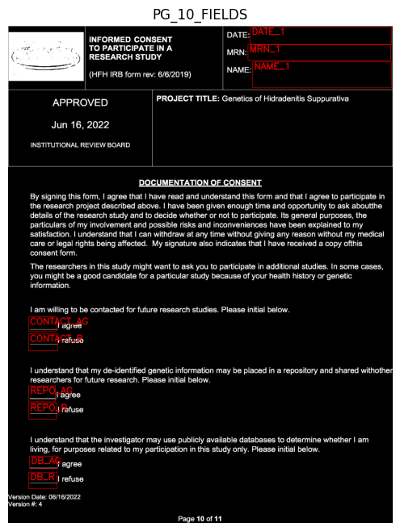

# HFHS HS Patient Consent Form Field Extractor

This script processes the last two pages of the Henry Ford Health System (HFHS) High School patient consent form, extracting key patient fields into a JSON format. It uses Optical Character Recognition (OCR) to detect the text and identifies whether handwriting exists in specific fields.

⚠ **Note:** This script has limitations with reading handwriting accurately. Currently, it works best for detecting the presence of handwriting in specific fields but may struggle with accurately extracting handwritten text.

## Features

- Processes individual files or folders containing multiple PDFs.
- Extracts fields like MRN, Name, and Date into a structured JSON format.
- Outputs decision fields (e.g., Consent or Refusal).
- Detects handwriting presence in exit fields.

## Prerequisites

- **Tesseract OCR**: Download and install from [here](https://github.com/UB-Mannheim/tesseract/wiki) and configure its path in ocr_intake_form.py.
- **Python libraries**:
  - `pytesseract`
  - `pdf2image`
  - `opencv-python`
  - `numpy`
  - `click`
  - `tqdm`

Install dependencies using:

```bash
pip install -r requirements.txt
```

## Command Line Usage

### Arguments

| Argument          | Description                                                                 |
|-------------------|-----------------------------------------------------------------------------|
| `-i, --input_path`  | **Required**: Path to a single PDF containing the last two pages of the consent form, or a directory containing multiple such PDFs. |
| `-o, --output_path` | **Required**: Folder path where the extracted JSON data should be stored.  |
| `-d, --delete`      | Optional: Set to `True` to delete the PDFs after processing. Default is `False`. |
| `-h, --help`      | Returns argument information. |

### Example

To process a single file:

```bash
python script.py -i path/to/consent_form.pdf -o path/to/output_folder
```

To process a folder containing multiple files:

```bash
python script.py -i path/to/folder_with_pdfs -o path/to/output_folder
```

To process files and delete the PDFs after processing:

```bash
python script.py -i path/to/folder_with_pdfs -o path/to/output_folder -d True
```

## Bounding Boxes for Patient Fields

The script uses bounding boxes to extract specific fields from each page. Below are the images representing these bounding boxes for the fields on pages 10 and 11 of the form.

  

  

These images illustrate the areas where patient data is located on the form, helping the script to extract the necessary fields accurately.

## JSON Output

The script outputs extracted text fields into a JSON file with the following structure:

```json
{
    "DATE_1": "4/17/2024",
    "MRN_1": null,
    "NAME_1": "PATIENT NAME",
    "CONTACT": "AGREED",
    "REPO": "AGREED",
    "DB": "AGREED",
    "DATE_2": null,
    "MRN_2": null,
    "NAME_2": "PATIENT NAME",
    "SUBJECT_SIG_DATE": "EXISTS",
    "SUBJECT_SIG_TIME": "EXISTS",
    "SUBJECT_SIG": "EXISTS",
    "SUBJECT_NAME": "EXISTS",
    "WITNESS_SIG": "EXISTS",
    "DOC_SIG": "EXISTS",
    "DOC_NAME": null,
    "WITNESS_SIG_DATE": "EXISTS",
    "WITNESS_SIG_TIME": "EXISTS",
    "DOC_DATE": "EXISTS",
    "DOC_TIME": "EXISTS"
}
```

- **`null`** values indicate an OCR confidence of less than 50%, which requires manual verification.
- **`EXISTS`** indicates the presence of handwriting in the field.
- **`AGREED/REFUSED`** signifies the patient's decision in fields where they provide consent or refusal by initialing.

## Limitations

- **Handwriting Detection**: This script does not excel at reading or extracting handwritten text. Instead, it can confirm whether handwriting exists within a field.
- **PDF Format**: The script expects the input PDFs to contain two pages, sequentially representing pages 10 and 11 of the form. Other formats will raise an error.

---

This tool is designed to automate and simplify the extraction of patient data from consent forms, helping streamline data collection efforts.
